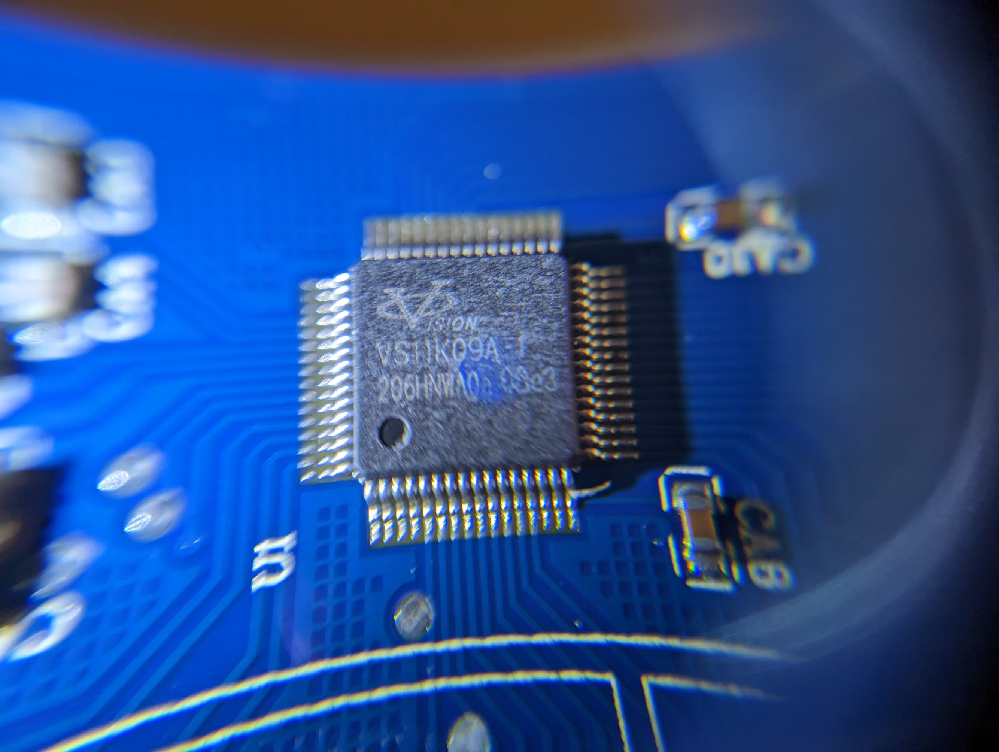
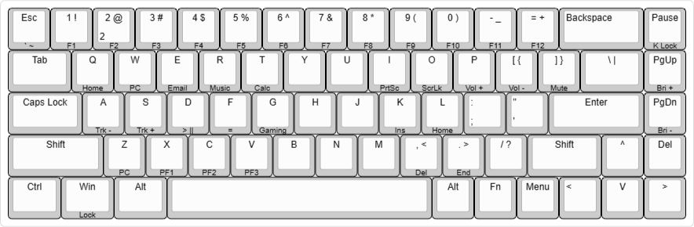

# Magic Refiner MK14-68 RGB

This is partial and may or may not be completed.
Use this information at your own discretion and risk.

## Chips
* Main MCU - eVision VS11K09A-1 - appears to be based on/clone of [SONIX SN32F24xB](http://www.sonix.com.tw/article-tw-4315-30347)

## Key Matrix & MCU
[Keyboard Layout ](http://www.keyboard-layout-editor.com/##@_backcolor=#ffffff&name=Magic%20Refiner%20MK14-68%20Keys&author=Sam%20Bartle&notes=B-Sun%20Blue%20Switches&switchMount=cherry;&@_a:5;&=Esc%0A%0A%0A%0A%60%20%20~&=1%20%20!%0A%0A%0A%0AF1&_a:4;&=%0A2%0A%0A%0AF2%0A%0A%0A%0A2%20%20/@&_a:5;&=3%20%20#%0A%0A%0A%0AF3&=4%20%20$%0A%0A%0A%0AF4&=5%20%20%25%0A%0A%0A%0AF5&=6%20%20%5E%0A%0A%0A%0AF6&=7%20%20/&%0A%0A%0A%0AF7&=8%20%20*%0A%0A%0A%0AF8&=9%20%20(%0A%0A%0A%0AF9&=0%20%20)%0A%0A%0A%0AF10&=-%20%20/_%0A%0A%0A%0AF11&=/=%20%20+%0A%0A%0A%0AF12&_a:4&w:2;&=Backspace&_a:5;&=Pause%0A%0A%0A%0AK%20Lock;&@_w:1.5;&=Tab&=Q%0A%0A%0A%0AHome&=W%0A%0A%0A%0APC&=E%0A%0A%0A%0AEmail&=R%0A%0A%0A%0AMusic&=T%0A%0A%0A%0ACalc&=Y&=U&=I%0A%0A%0A%0APrtSc&=O%0A%0A%0A%0AScrLk&=P%0A%0A%0A%0AVol%20+&=%5B%20%20%7B%0A%0A%0A%0AVol%20-&=%5D%20%20%7D%0A%0A%0A%0AMute&_w:1.5;&=%5C%20%20%7C&=PgUp%0A%0A%0A%0ABri%20+;&@_w:1.75;&=Caps%20Lock&=A%0A%0A%0A%0ATrk%20-&=S%0A%0A%0A%0ATrk%20+&=D%0A%0A%0A%0A%3E%20%20%7C%7C&=F%0A%0A%0A%0A/=&=G%0A%0A%0A%0AGaming&=H&=J&=K%0A%0A%0A%0AIns&=L%0A%0A%0A%0AHome&_a:4;&=/:%0A/;&=%22%0A'&_a:5&w:2.25;&=Enter&=PgDn%0A%0A%0A%0ABri%20-;&@_w:2.25;&=Shift&=Z%0A%0A%0A%0APC&=X%0A%0A%0A%0APF1&=C%0A%0A%0A%0APF2&=V%0A%0A%0A%0APF3&=B&=N&=M&=,%20%20%3C%0A%0A%0A%0ADel&=.%20%20%3E%0A%0A%0A%0AEnd&=//%20%20?&_w:1.75;&=Shift&=%5E&=Del;&@_w:1.25;&=Ctrl&_w:1.25;&=Win%0A%0A%0A%0ALock&_w:1.25;&=Alt&_a:7&w:6.25;&=&_a:5;&=Alt&=Fn&=Menu&_a:4;&=%3C&_a:5;&=V&=%3E)

## MCU-Diagram - Keyboard matrix diagram on the MCU

| --- | col | C0 | C1 | C2 | C3 | C4 | C5 | C6 | C7 | C8 | C9 | C10 | C11 | C12 | C13 | C14 | C15 |
| --- | --- | -- | -- | -- | -- | -- | -- | -- | -- | -- | -- | --- | --- | --- | --- | --- | --- |
| row | pin | 31 | 30 | 29 | 28 | 27 | 26 | 25 | 24 | 23 | 22 | 21  | 20  | 19  | 18  | 17  | 16  |
| R0  | 63  |    |    |    |    |    |    |    |    |    |    |     |     |     |     |     |     |
| R1  | 62  |    |    |    |    |    |    |    |    |    |    |     |     |     |     |     |     |
| R2  | 61  |    |    |    |    |    |    |    |    |    |    |     |     |     |     |     |     |
| R3  | 60  |    |    |    |    |    |    |    |    |    |    |     |     |     |     |     |     |
| R4  | 59  |    |    |    |    |    |    |    |    |    |    |     |     |     |     |     |     |

## MCU-Diagram - LED matrix

|   g  |   b  |   r  |  --- |  --- |  --- | col | C0 | C1 | C2 | C3 | C4 | C5 | C6 | C7 | C8 | C9 | C10 | C11 | C12 | C13 | C14 | C15 | C16 | C17 | C18 |
|  --- |  --- |  --- |  --- |  --- |  --- | --- | -- | -- | -- | -- | -- | -- | -- | -- | -- | -- | --  | --  | --  | --  | --  | --  | --  | --  | --  |
|  ch1 |  ch2 |  ch3 |  pin |  pin |  pin | pin | 25 | 26 | 27 | 28 | 29 | 30 | 31 | 32 | 34 | 35 | 36  | 37  | 38  | 39  | 40  | 41  | 42  | 43  | 44  |
|  Q13 |  Q7  |  Q1  |  01  |  02  |  04  | --- | -- | -- | -- | -- | -- | -- | -- | -- | -- | -- | --- | --- | --- | --- | --- | --- | --- | --- | --- |
|  Q14 |  Q8  |  Q2  |  05  |  06  |  07  | --- | -- | -- | -- | -- | -- | -- | -- | -- | -- | -- | --- | --- | --- | --- | --- | --- | --- | --- | --- |
|  Q15 |  Q9  |  Q3  |  08  |  09  |  10  | --- | -- | -- | -- | -- | -- | -- | -- | -- | -- | -- | --- | --- | --- | --- | --- | --- | --- | --- | --- |
|  Q16 |  Q10 |  Q4  |  11  |  12  |  13  | --- | -- | -- | -- | -- | -- | -- | -- | -- | -- | -- | --- | --- | --- | --- | --- | --- | --- | --- | --- |
|  Q17 |  Q11 |  Q5  |  14  |  15  |  47  | --- | -- | -- | -- | -- | -- | -- | -- | -- | -- | -- | --- | --- | --- | --- | --- | --- | --- | --- | --- |
|  Q18 |  Q12 |  Q6  |  50  |  49  |  48  | --- | -- | -- | -- | -- | -- | -- | -- | -- | -- | -- | --- | --- | --- | --- | --- | --- | --- | --- | --- |

## MCU Pinout - SN32F248BF

